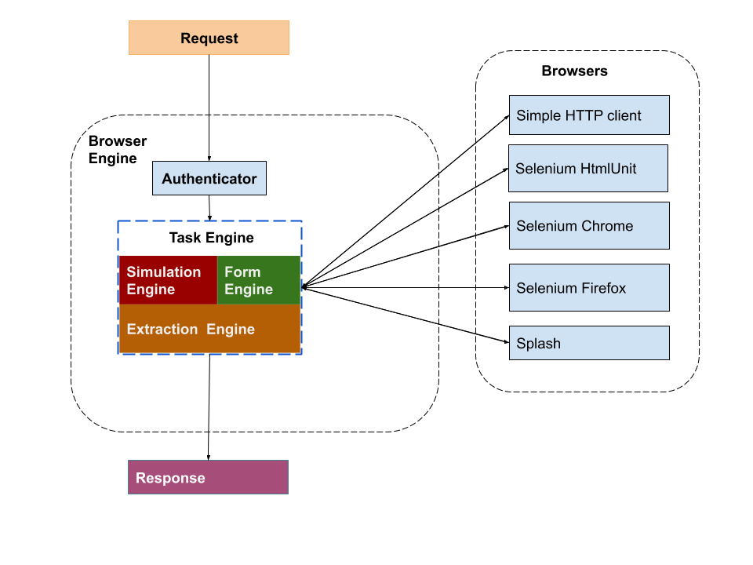
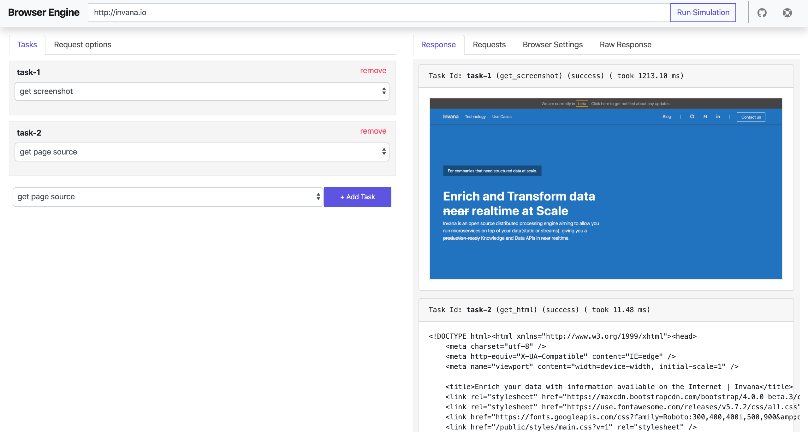

# Browser Engine

Web Automation and User behaviour simulations made easy with YAML configurations and  selenium driver code. 
This library can be used as standalone python code or via RESTful server.




## Requirements

- Python 3.6 or above
- Selenium webdriver for more powerful options like screenshot and browser simulations like click, wait, hover .


## Install via pip

```bash
# install browser engine via pip
pip install browser-engine
#or 
pip install -e git+https://github.com/invanalabs/browser-engine.git#egg=browser_engine
```

## Setup Selenium (optional)

Needed for more powerful options like screenshot and browser simulations like click, wait, hover .
```bash
docker run --name selenium-cr -d -p 4444:4444 -v /dev/shm:/dev/shm selenium/standalone-chrome:3.141.59-titanium
``` 

## Usage 

### method 1 - as Python code

```python
from browser_engine import WebSimulationRequest

tasks = {
    "task-1": {
        "task_type": "get_screenshot",
        "task_code": ""
    },
    "task-2": {
        "task_type": "get_html",
        "task_code": ""
    }
}


web_request =  WebSimulationRequest(
                    url= "https://invana.io",
                    method="GET",
                    init_headers="",
                    browser_settings={
                        "viewport": "1280x720",
                        "timeout": 180,
                        "load_images": False
                    },
                    tasks=tasks
                )
response = web_request.run()

print(response)
{
    "message": "Ok",
    "client": {
        "browser_type": "CHROME",
        "elapsed_time_ms": "2761.44 ms"
    },
    "request": {
        "url": "http://invana.io",
        "method": "GET",
        "init_headers": None,
        "browser_settings": {
            "load_images": False,
            "viewport": "1280x720",
            "timeout": 180
        },
        "tasks": {
            "task-1": {
                "task_type": "get_screenshot",
                "task_code": ""
            },
            "task-2": {
                "task_type": "get_html",
                "task_code": ""
            }
        }
    },
    "response": {
        "task_results": {
            "task-1": {
                "data": "<base64 encoded screenshot data comes here>",
                "task_type": "get_screenshot",
                "is_task_success": True,
                "error_message": None,
                "task_start_time": "2020-03-10 10:41:07.322361",
                "task_end_time": "2020-03-10 10:41:07.830615",
                "task_elapsed_time_ms": "508.25 ms",
                "cookies": [
                    {
                        "domain": ".invana.io",
                        "expiry": 1583817127,
                        "httpOnly": False,
                        "name": "_gat_gtag_UA_160182934_1",
                        "path": "/",
                        "secure": False,
                        "value": "1"
                    },
                    {
                        "domain": ".invana.io",
                        "expiry": 1583903467,
                        "httpOnly": False,
                        "name": "_gid",
                        "path": "/",
                        "secure": False,
                        "value": "GA1.2.235347658.1583817067"
                    },
                    {
                        "domain": ".invana.io",
                        "expiry": 1646889067,
                        "httpOnly": False,
                        "name": "_ga",
                        "path": "/",
                        "secure": False,
                        "value": "GA1.2.1658368700.1583817067"
                    }
                ]
            },
            "task-2": {
                "data": "<html code comes here>",
                "task_type": "get_html",
                "is_task_success": True,
                "error_message": None,
                "task_start_time": "2020-03-10 10:41:07.843921",
                "task_end_time": "2020-03-10 10:41:07.853598",
                "task_elapsed_time_ms": "9.68 ms",
                "cookies": [
                    {
                        "domain": ".invana.io",
                        "expiry": 1583817127,
                        "httpOnly": False,
                        "name": "_gat_gtag_UA_160182934_1",
                        "path": "/",
                        "secure": False,
                        "value": "1"
                    },
                    {
                        "domain": ".invana.io",
                        "expiry": 1583903467,
                        "httpOnly": False,
                        "name": "_gid",
                        "path": "/",
                        "secure": False,
                        "value": "GA1.2.235347658.1583817067"
                    },
                    {
                        "domain": ".invana.io",
                        "expiry": 1646889067,
                        "httpOnly": False,
                        "name": "_ga",
                        "path": "/",
                        "secure": False,
                        "value": "GA1.2.1658368700.1583817067"
                    }
                ]
            }
        },
        "client": {
            "job_start_time": "2020-03-10 10:41:07.322316",
            "job_end_time": "2020-03-10 10:41:07.860340",
            "job_elapsed_time_ms": "538.02 ms"
        }
    }
}
     
``` 

### method 2 - via RESTful server

When running in RESTful server, mode all the browser_settings from pythonic way goes into URL params.
Here is the simple usage. 

```
# Assuming restful server is running at http://0.0.0.0:5000
import requests
from urllib.parse import quote_plus

payload = {"init_headers": "", "tasks": {"task-1": {"task_type": "get_screenshot", "task_code": ""}}}
response = requests.post("http://0.0.0.0:5000/execute?url={url}&viewport=1280x720&timeout=180&method=get"
                         "&load_images=0&token=iamlazydeveloper".format(
    url=quote_plus("http://invana.io")),
    data=payload)
print(response.status_code)
print(response.json())
```


## Screenshots


 

 
